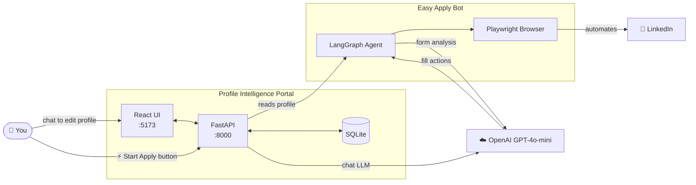
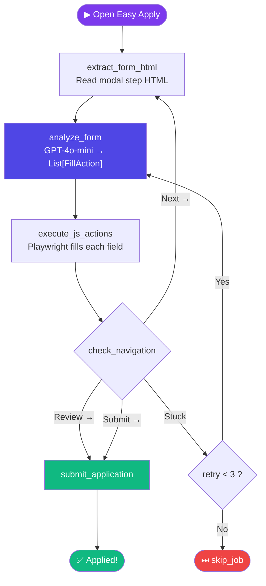
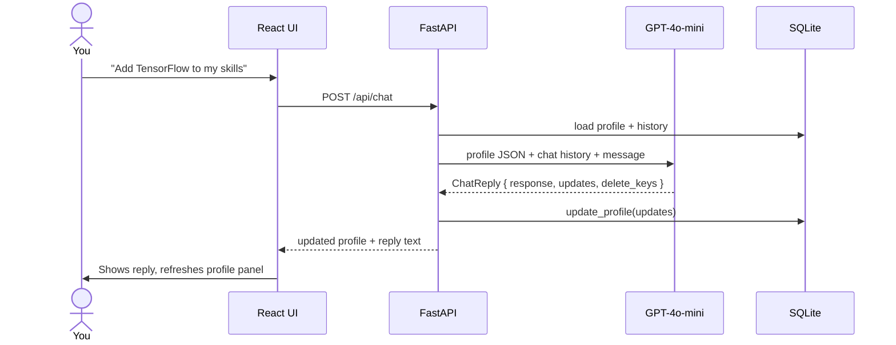

# 🤖 LinkedIn Easy Apply Automation Agent

> [!CAUTION]
> **This project is for educational and learning purposes only.**
> Do not use this tool to spam job applications, violate LinkedIn's Terms of Service, or misrepresent your identity. The author takes no responsibility for any misuse.

An intelligent job application bot that reads your profile, opens LinkedIn, and fills Easy Apply forms automatically — powered by **LangGraph + OpenAI GPT-4o-mini + Playwright**.

---

## System Architecture



---

## What You Can Do in the Portal

Open **http://localhost:5173** after starting both servers. The portal has two panels:

### 💬 Left — AI Chat (Profile Assistant)
Talk to the AI to build and update your profile:

| What to say | What happens |
|---|---|
| `"My name is Jane, email is jane@example.com"` | Basic info saved to DB |
| `"I know Python, FastAPI, Docker and AWS"` | Skills list updated |
| `"Expected CTC 10 LPA, notice period 30 days"` | Job preferences saved |
| `"Add a certification: AWS Solutions Architect"` | Custom `certifications` key created |
| `"Remove the certifications field"` | Key deleted from profile |
| `"What should I add to get more interviews?"` | AI gives advice (no DB change) |

The AI only writes to the database when you explicitly ask it to update something. You can ask questions freely — they won't modify your profile.

### 👤 Right — Profile Panel
- Live view of everything stored in your profile
- Custom fields (created via chat) appear under **Additional Info** with a **×** delete button
- **Refresh** button (↻) to reload from DB
- **LinkedIn / GitHub / Portfolio** quick links if set

---

## Running Auto Apply

### Option A — From the Portal UI *(recommended)*

1. Make sure both servers are running
2. Go to **http://localhost:5173**
3. Set up your profile via chat first
4. Click **⚡ Start Auto Apply** in the top-right header
5. The button turns red and shows a live **PID** — the bot is running
6. Click **■ Stop Auto Apply** to kill it at any time

> The portal polls the bot status every 5 seconds. If the bot crashes, the button resets to idle automatically.

### Option B — From the Terminal *(headless / direct)*

```bash
# Make sure you've logged in to LinkedIn first:
python data/setup_linkedin_browser.py

# Then run the bot directly:
python run_easy_apply.py
```

The bot will open a Chromium window, navigate to LinkedIn, search for Easy Apply jobs, and start applying using your profile.

---

## Profile Context Priority

`user_profile.py` feeds the agent its context. It checks in this order:

```
1. SQLite DB  →  profile_portal/backend/profile_portal.db  (live, edited via portal)
2. EXAMPLE_PROFILE  →  user_profile.py  (fallback — edit with your details)
```

**If running for the first time without the portal**, open `user_profile.py` and edit `EXAMPLE_PROFILE` at the top with your own details — name, email, skills, CTC, etc. The bot will use this JSON as context for all form fields.

---

### Step 3 — LangGraph applies, step by step



---

## Chat Workflow



---

## Project Structure

```
job-apply-agent/
├── easy_apply_agent.py        # LangGraph agent (form fill logic)
├── run_easy_apply.py          # Entry point — Playwright loop
├── user_profile.py            # Reads SQLite profile → JSON for LLM
├── data/
│   └── setup_linkedin_browser.py   # One-time LinkedIn login
├── profile_portal/
│   ├── backend/               # FastAPI + SQLite
│   │   ├── main.py            # Routes (profile, chat, apply control)
│   │   ├── chat_service.py    # LLM chat + Pydantic structured output
│   │   └── db.py              # Profile & message CRUD
│   └── frontend/              # React + Vite
│       └── src/
│           ├── App.jsx
│           ├── components/ChatPanel.jsx
│           ├── components/ProfilePanel.jsx
│           └── api/client.js
├── requirements.txt
└── .env                       # OPENAI_API_KEY (gitignored)
```

---

## Quick Start

```bash
# 1. Install
git clone https://github.com/akashcodejames/linkedin-easy-apply-agent
cd linkedin-easy-apply-agent
pip install -r requirements.txt
playwright install chromium

# 2. Set your API key in .env
echo "OPENAI_API_KEY=sk-..." > .env

# 3. Login to LinkedIn (one time)
python data/setup_linkedin_browser.py

# 4. Start the portal (two terminals)
cd profile_portal/backend && source venv/bin/activate && uvicorn main:app --reload --port 8000
cd profile_portal/frontend && npm install && npm run dev

# 5. Open http://localhost:5173 — update profile, then click ⚡ Start Auto Apply
```

---

## Tech Stack

| | Tech |
|---|---|
| Browser | Playwright (Chromium, persistent session) |
| Agent | LangGraph state machine |
| LLM | OpenAI GPT-4o-mini |
| Structured output | Pydantic v2 + `with_structured_output()` |
| Profile store | SQLite → `json.dumps` into LLM prompt |
| Backend | FastAPI + uvicorn |
| Frontend | React + Vite |
| Chat memory | ConversationSummaryBuffer |
