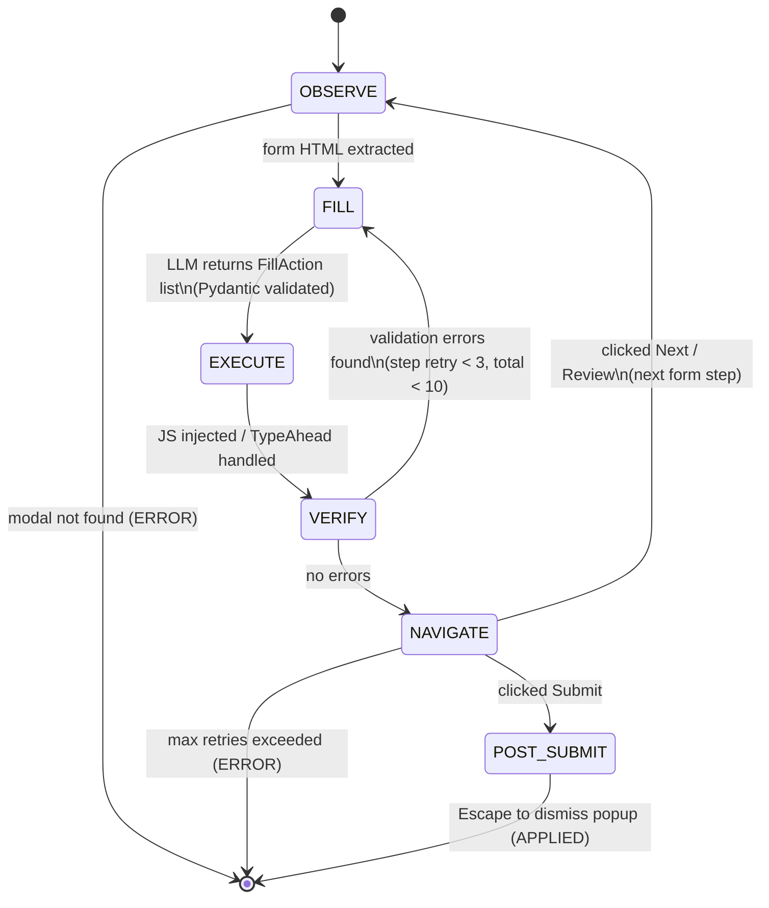
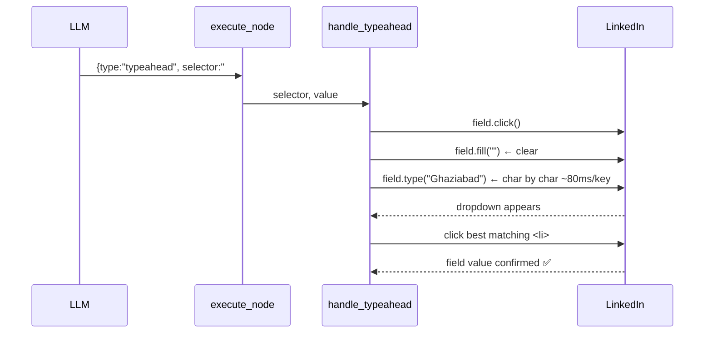

# LinkedIn Easy Apply Agent 🤖

An autonomous agent that applies to LinkedIn **Easy Apply** jobs using a **LangGraph state machine**, **Playwright** browser automation, and **OpenAI GPT-4o-mini** with Pydantic structured output — so the LLM response is always schema-valid.

---

## ✨ Features

| Feature | Details |
|---|---|
| **Agentic Loop** | LangGraph state machine with Observe → Fill → Execute → Verify → Navigate |
| **Pydantic Structured Output** | LLM response schema-enforced via OpenAI function calling — no JSON parsing errors |
| **TypeAhead Field Handler** | Playwright types char-by-char, waits for dropdown, clicks best option (Location, City) |
| **Graceful Error Recovery** | Max 3 retries per step, 10 total. Handles "Save this application?" dialog automatically |
| **Anti-Detection** | Random mouse jitter, hover-before-click, randomized delays (3–12s cooldown), anti-fingerprinting browser flags |
| **Persistent Login** | Saves LinkedIn session cookies — log in once, run forever |

---

## 🗺️ Architecture & Workflow

### High-Level Flow

```mermaid
flowchart TD
    A[🚀 Start Bot] --> B[Open LinkedIn Jobs Search]
    B --> C[Scroll to Load All Jobs]
    C --> D{For Each Job}

    D --> E[Scroll Card Into View\n+ Mouse Jitter]
    E --> F[Click Job Card\nwith Hover]
    F --> G{Easy Apply\nButton?}

    G -- No --> H[⏭️ Skip Job]
    G -- Yes --> I[Click Easy Apply]
    I --> J{Modal\nOpened?}

    J -- No --> H
    J -- Yes --> K[[🤖 LangGraph Agent\nrun_easy_apply&#40;&#41;]]

    K --> R{Result}
    R -- APPLIED --> S[✅ Log Success]
    R -- SKIPPED/ERROR --> T[🗑️ dismiss_modal_gracefully\nHandle Save/Discard Dialog]

    S --> U[⏱️ Random Cooldown\n3–12 seconds]
    T --> U
    H --> U
    U --> D
```



### LangGraph Agent — Internal State Machine



### TypeAhead Field Handling



---

## 📂 Project Structure

```
linkedin-easy-apply-agent/
├── easy_apply_agent.py     # 🧠 The Brain — LangGraph agent (all nodes + routing)
├── run_easy_apply.py       # 🚀 Runner — scrolls jobs, filters Easy Apply, anti-detection
├── user_profile.py         # 👤 Your resume/profile config for the LLM
├── data/
│   └── setup_linkedin_browser.py  # 🔑 One-time login to save session
├── .env                    # API keys & model config
└── requirements.txt
```

### Key Components in `easy_apply_agent.py`

| Component | Purpose |
|---|---|
| `FillAction` (Pydantic) | Schema for a single fill action (`fill` or `typeahead`) |
| `EasyApplyResponse` (Pydantic) | Schema for all actions in one form step |
| `get_llm()` | Creates LLM instance (OpenAI default, Ollama optional via `MODEL_PROVIDER` env) |
| `observe_node()` | Extracts the current modal step HTML |
| `fill_node()` | Calls LLM with structured output, gets typed actions |
| `execute_node()` | Runs JS for `fill` actions, Playwright for `typeahead` actions |
| `verify_node()` | Checks for `.artdeco-inline-feedback--error` validation errors |
| `navigate_node()` | Clicks Next/Review/Submit, LLM fallback if selectors fail |
| `handle_typeahead()` | Types char-by-char, waits for dropdown, clicks best match |
| `dismiss_modal_gracefully()` | Handles "Save this application?" dialog before moving to next job |

---

## 🚀 Quick Start

### 1. Clone & Setup

```bash
git clone https://github.com/akashcodejames/linkedin-easy-apply-agent.git
cd linkedin-easy-apply-agent

python3 -m venv venv
source venv/bin/activate
pip install -r requirements.txt
playwright install chromium
```

### 2. Configure

**Edit `.env`:**
```ini
OPENAI_API_KEY=sk-proj-...
MODEL_PROVIDER=openai   # or 'ollama' for local models
```

**Edit `user_profile.py`** — fill in your real name, phone, location, experience, and skills. The more complete it is, the better the LLM fills forms.

### 3. Login to LinkedIn (Once)

```bash
python data/setup_linkedin_browser.py
```

A browser opens. Log in manually. Close the browser. Session is saved.

### 4. Run

```bash
python run_easy_apply.py
```

---

## ⚙️ Configuration

| Env Variable | Default | Description |
|---|---|---|
| `OPENAI_API_KEY` | — | Required if `MODEL_PROVIDER=openai` |
| `MODEL_PROVIDER` | `openai` | `openai` or `ollama` |
| `OLLAMA_MODEL` | `deepseek-coder-v2` | Model name when using Ollama |
| `OLLAMA_BASE_URL` | `http://localhost:11434` | Ollama server URL |

**To change the job search URL**, edit line in `run_easy_apply.py`:
```python
url = "https://www.linkedin.com/jobs/search/?keywords=python%20developer&location=India&f_TPR=r86400&f_AL=true"
```

---

## ⚠️ Safety & Disclaimer

- For **educational purposes** only.
- Use in short sessions (≤25 jobs/day) to avoid LinkedIn rate limiting.
- The bot uses a real browser (Playwright, non-headless) with human-like behavior to minimize detection risk.
- You are responsible for compliance with LinkedIn's Terms of Service.
