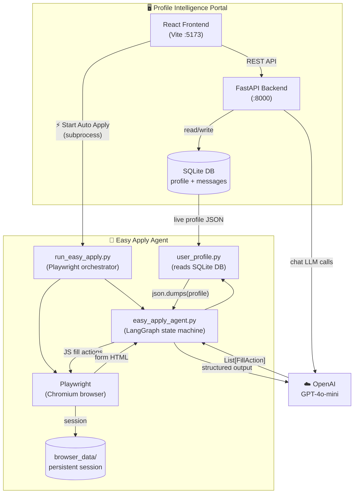
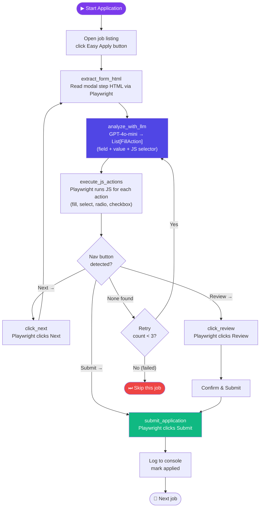
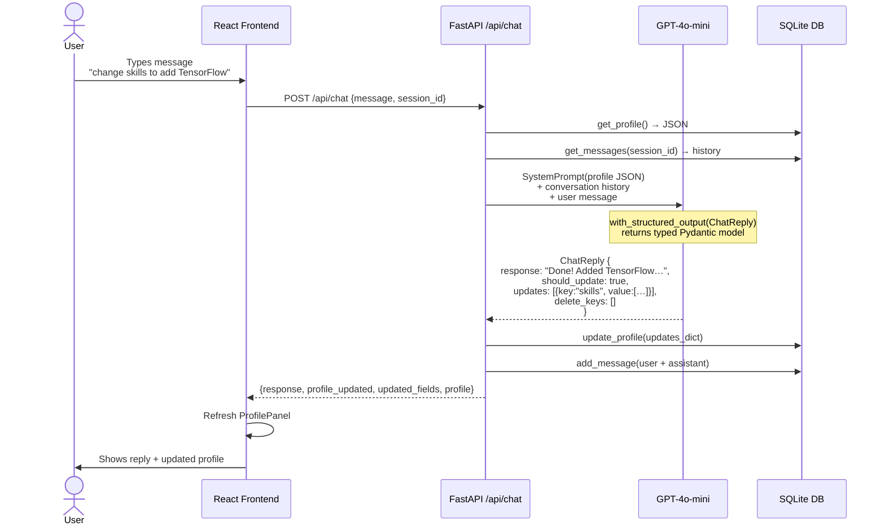

# 🤖 LinkedIn Easy Apply Automation Agent

An intelligent, end-to-end job application bot that automatically fills and submits LinkedIn Easy Apply forms — powered by **LangGraph**, **OpenAI GPT-4o-mini**, and **Playwright**.

Includes a **Profile Intelligence Portal** (React + FastAPI) where you manage your profile via AI chat and trigger the apply bot directly from the browser.

---

## System Architecture



---

## Easy Apply Agent — LangGraph Workflow



---

## Profile Portal — AI Chat Workflow



---

## Project Structure

```
linkedin-easy-apply-agent/
│
├── easy_apply_agent.py          # LangGraph agent — form analysis + JS fill actions
├── run_easy_apply.py            # Entry point — Playwright orchestration loop
├── user_profile.py              # Profile loader (reads SQLite DB → json.dumps)
│
├── data/
│   └── setup_linkedin_browser.py  # One-time LinkedIn login & session save
│
├── browser_data/                # Persistent Playwright session (gitignored)
│
├── profile_portal/
│   ├── backend/                 # FastAPI app
│   │   ├── main.py              # Routes: profile, chat, apply control (start/stop/status)
│   │   ├── chat_service.py      # LLM chat (memory buffer + Pydantic structured output)
│   │   ├── db.py                # SQLite helpers (profile CRUD + messages)
│   │   └── requirements.txt
│   └── frontend/                # React + Vite
│       └── src/
│           ├── App.jsx                # Layout + ⚡ Auto Apply button
│           ├── components/
│           │   ├── ChatPanel.jsx      # AI chat interface (markdown rendering)
│           │   └── ProfilePanel.jsx   # Profile viewer + delete custom keys (×)
│           └── api/client.js          # fetch wrappers for all endpoints
│
├── requirements.txt             # Agent deps (playwright, langchain, openai, langgraph)
├── .env                         # API keys (gitignored)
└── .gitignore
```

---

## Quick Start

### 1. Clone & Install

```bash
git clone https://github.com/akashcodejames/linkedin-easy-apply-agent
cd linkedin-easy-apply-agent

# Agent dependencies
pip install -r requirements.txt
playwright install chromium

# Portal backend
cd profile_portal/backend
python -m venv venv && source venv/bin/activate
pip install -r requirements.txt
cd ../..
```

### 2. Configure `.env`

```env
OPENAI_API_KEY=sk-...
```

### 3. Login to LinkedIn (one-time)

```bash
python data/setup_linkedin_browser.py
```

Opens Chromium — log in manually. Session saved to `browser_data/` permanently.

### 4. Start the Profile Portal

```bash
# Terminal 1 — Backend
cd profile_portal/backend && source venv/bin/activate
uvicorn main:app --reload --port 8000

# Terminal 2 — Frontend
cd profile_portal/frontend
npm install && npm run dev
```

Open **http://localhost:5173** and update your profile via AI chat.

### 5. Run the Apply Bot

**From the Portal UI:** Click **⚡ Start Auto Apply** in the header.

**From terminal:**
```bash
python run_easy_apply.py
```

---

## Key Tech

| Layer | Tech |
|---|---|
| Browser automation | Playwright (Chromium, persistent session) |
| Agent orchestration | LangGraph state machine |
| LLM | OpenAI GPT-4o-mini |
| Structured output | Pydantic v2 + `with_structured_output()` |
| Profile storage | SQLite (read via `json.dumps` into LLM prompt) |
| Portal backend | FastAPI + uvicorn |
| Portal frontend | React + Vite |
| Chat memory | ConversationSummaryBuffer (auto-compresses) |

---

> **Note:** The bot only applies to jobs with the blue **Easy Apply** button. Always test with a few applications manually before running at scale.
