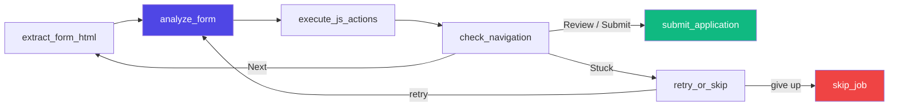
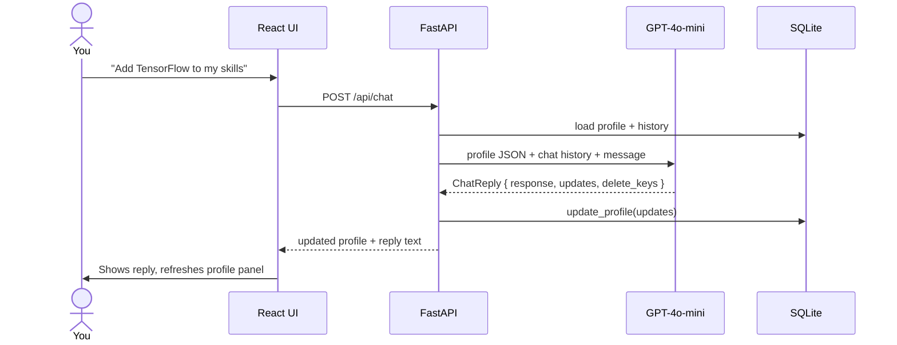

# 🤖 LinkedIn Easy Apply Automation Agent

> [!CAUTION]
> **This project is for educational and learning purposes only.**
> Do not use this tool to spam job applications, violate LinkedIn's Terms of Service, or misrepresent your identity. The author takes no responsibility for any misuse.

An intelligent job application bot that reads your profile, opens LinkedIn, and fills Easy Apply forms automatically — powered by **LangGraph + OpenAI GPT-4o-mini + Playwright**.

---

## System Architecture


---

## How It Works

### Step 1 — Set Up Your Profile
Chat with the AI in the portal to fill out your profile:
> *"My expected CTC is 8 LPA, notice period is 30 days, I know Python and AWS"*

The LLM detects what to save and updates the SQLite DB instantly.

### Step 2 — Launch the Bot
Click **⚡ Start Auto Apply** in the portal header (or run `python run_easy_apply.py`). The bot opens LinkedIn in a Chromium window and starts applying.

### Step 3 — LangGraph applies, step by step



---

## Chat Workflow



---

## Project Structure

```
job-apply-agent/
├── easy_apply_agent.py        # LangGraph agent (form fill logic)
├── run_easy_apply.py          # Entry point — Playwright loop
├── user_profile.py            # Reads SQLite profile → JSON for LLM
├── data/
│   └── setup_linkedin_browser.py   # One-time LinkedIn login
├── profile_portal/
│   ├── backend/               # FastAPI + SQLite
│   │   ├── main.py            # Routes (profile, chat, apply control)
│   │   ├── chat_service.py    # LLM chat + Pydantic structured output
│   │   └── db.py              # Profile & message CRUD
│   └── frontend/              # React + Vite
│       └── src/
│           ├── App.jsx
│           ├── components/ChatPanel.jsx
│           ├── components/ProfilePanel.jsx
│           └── api/client.js
├── requirements.txt
└── .env                       # OPENAI_API_KEY (gitignored)
```

---

## Quick Start

```bash
# 1. Install
git clone https://github.com/akashcodejames/linkedin-easy-apply-agent
cd linkedin-easy-apply-agent
pip install -r requirements.txt
playwright install chromium

# 2. Set your API key in .env
echo "OPENAI_API_KEY=sk-..." > .env

# 3. Login to LinkedIn (one time)
python data/setup_linkedin_browser.py

# 4. Start the portal (two terminals)
cd profile_portal/backend && source venv/bin/activate && uvicorn main:app --reload --port 8000
cd profile_portal/frontend && npm install && npm run dev

# 5. Open http://localhost:5173 — update profile, then click ⚡ Start Auto Apply
```

---

## Tech Stack

| | Tech |
|---|---|
| Browser | Playwright (Chromium, persistent session) |
| Agent | LangGraph state machine |
| LLM | OpenAI GPT-4o-mini |
| Structured output | Pydantic v2 + `with_structured_output()` |
| Profile store | SQLite → `json.dumps` into LLM prompt |
| Backend | FastAPI + uvicorn |
| Frontend | React + Vite |
| Chat memory | ConversationSummaryBuffer |
